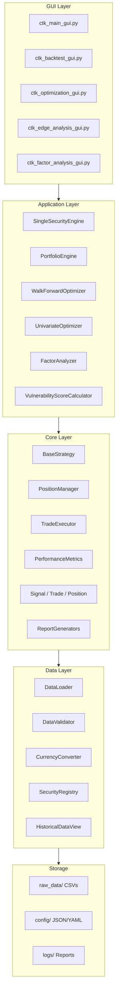

---
tags:
  - implementation
  - architecture
---

# Architecture Overview

High-level design of the BackTesting Framework.

---

## Layered Architecture

The system is organised into four layers. Each layer depends only on the layers below it.



---

## Layer Responsibilities

### GUI Layer
- Desktop interfaces built with **CustomTkinter**
- Each tool has its own GUI application (`ctk_*_gui.py`)
- A main launcher (`ctk_main_gui.py`) provides a unified entry point
- GUIs read config files and delegate all logic to the Application Layer

### Application Layer
- **Engines** — orchestrate backtesting by coordinating strategies, data, and trade execution
- **Optimisers** — run multiple backtests with different parameters, select the best
- **Analysers** — factor analysis, edge analysis, vulnerability scoring

### Core Layer
- **Strategy framework** — `BaseStrategy` abstract class and `StrategyContext`
- **Models** — `Trade`, `Position`, `Signal`, `Order` data classes
- **Trade execution** — `PositionManager` and `TradeExecutor`
- **Metrics and reporting** — performance calculation and Excel/CSV output

### Data Layer
- **DataLoader** — reads CSV files, validates columns
- **CurrencyConverter** — handles multi-currency conversions using FX data
- **SecurityRegistry** — maps tickers to metadata (currency, exchange)
- **HistoricalDataView** — provides a windowed view of data for strategy context

### Storage
- `raw_data/` — historical market data as CSVs
- `config/` — JSON/YAML configuration, baskets, presets
- `logs/` — backtest results, optimisation reports

---

## Module Map

```
Classes/
├── Analysis/          → PerformanceMetrics, ExcelReportGenerator, TradeLogger
├── Config/            → BacktestConfig, PortfolioConfig, CapitalContentionConfig
├── Core/              → Centralised performance metrics
├── Data/              → DataLoader, DataValidator, CurrencyConverter
├── Engine/            → SingleSecurityEngine, PortfolioEngine, PositionManager, TradeExecutor
├── FactorAnalysis/    → Analyzer (Tier 1/2/3), scenario detection
├── Indicators/        → Indicator utilities
├── Models/            → Trade, Position, Signal, Order, TradeDirection
├── Optimization/      → WalkForwardOptimizer, UnivariateOptimizer, BayesianSearch
└── Strategy/          → BaseStrategy, StrategyContext, FundamentalRules
```

---

## Design Principles

### No Lookahead Bias
The engine feeds data to strategies one bar at a time via `StrategyContext`. Strategies cannot access future bars. All standard indicators are pre-calculated in the raw CSV data. The framework includes automatic checks for look-ahead bias in custom `prepare_data()` implementations.

### Pre-Calculated Indicators
Indicators exist as columns in the CSV files. The framework does **not** calculate standard indicators at runtime. This ensures:
- Consistent results across runs
- No accidental bias from indicator calculation
- Fast execution (no repeated computation)

### Realistic Execution
- Trades execute at the **closing price** of the signal bar
- **Commission** is deducted on entry and exit
- **Slippage** is applied as a percentage
- **Position sizing** is risk-based by default (risking N% of equity at the stop loss distance)

### Strategy Contract
Every strategy implements the same interface (`BaseStrategy`), making all strategies interchangeable. The engine doesn't know or care about strategy internals — it just calls `generate_signal()` on each bar.

### Configuration as Data
All configuration lives in JSON/YAML files, not in code. Strategy parameters, baskets, presets, and optimisation settings are all file-based, enabling easy sharing and versioning.

---

## Key Interactions

For how these components work together in practice, see the [[Backtest Execution Flow|System Flows]] section.
