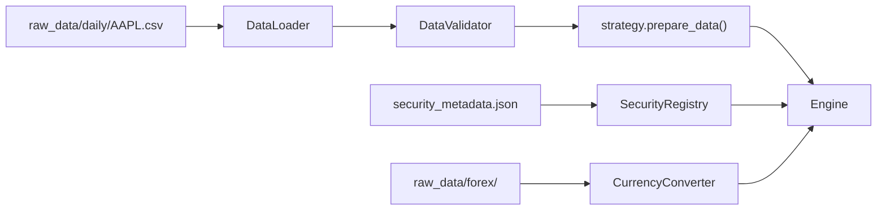

---
tags:
  - implementation/component
  - data
---

# Data Layer

Responsible for loading, validating, and transforming market data before it reaches the engine.

---

## Key Classes

| Class | File | Purpose |
|---|---|---|
| `DataLoader` | `Classes/Data/data_loader.py` | Reads CSV files, validates required columns, aligns date ranges |
| `DataValidator` | `Classes/Data/data_validator.py` | Checks data quality (missing values, duplicates, sorting) |
| `CurrencyConverter` | `Classes/Data/currency_converter.py` | Converts trade values between currencies using FX rate data |
| `SecurityRegistry` | `Classes/Data/security_registry.py` | Maps tickers to metadata (currency, exchange, name) |
| `HistoricalDataView` | `Classes/Data/historical_data_view.py` | Provides a windowed view of data for `StrategyContext` |

---

## Data Flow

1. **DataLoader** reads the CSV into a pandas DataFrame
2. **DataValidator** checks for required columns, sorts by date, handles duplicates
3. The strategy's `prepare_data()` adds any custom indicators
4. The engine iterates bar-by-bar, creating a **HistoricalDataView** for each bar
5. **CurrencyConverter** provides FX rates when the security's currency differs from the account's base currency

---

## CSV Requirements

- File path: `raw_data/daily/{SYMBOL}.csv`
- Minimum columns: `date`, `close`
- Recommended: `open`, `high`, `low`, `volume`
- Strategy-specific: indicator columns (e.g. `atr_14_atr`, `mfi_14_mfi`)
- Sorted ascending by date

---

## HistoricalDataView

This class provides the strategy with a **read-only window** into historical data up to the current bar. It powers `StrategyContext.get_indicator_value()` and prevents any access to future data.

---

## Multi-Currency Support

The `CurrencyConverter` loads FX time series from `raw_data/forex/` and provides daily exchange rates. When a security trades in USD but the account is in GBP, all P/L calculations are converted using the rate on the trade date.

`SecurityRegistry` (fed by `config/security_metadata.json`) tells the system which currency each security trades in.

---

## Related

- [[Adding a New Security]] — how to add data
- [[Adding a New Indicator]] — how to add indicator columns
- [[Backtest Execution Flow]] — how data flows into the engine
