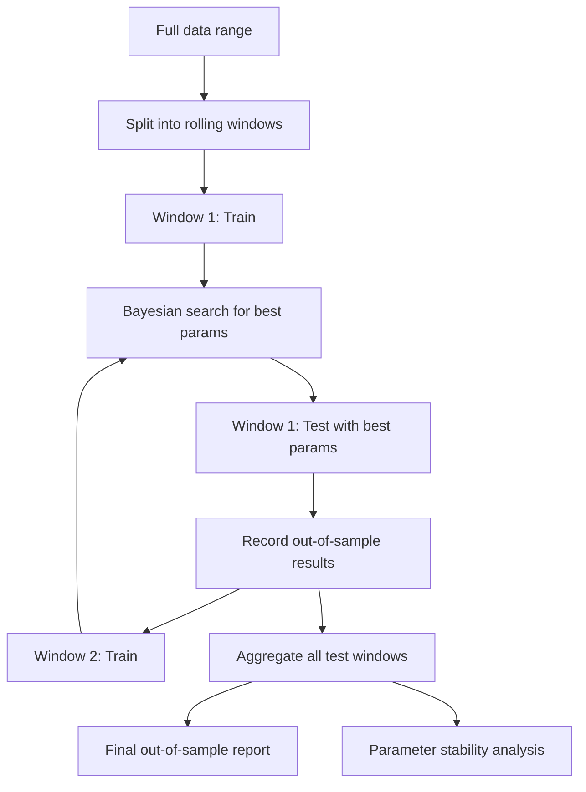

---
tags:
  - implementation/component
  - optimisation
---

# Optimisation Engine

Parameter search and validation systems.

---

## Key Classes

| Class | File | Purpose |
|---|---|---|
| `WalkForwardOptimizer` | `Classes/Optimization/walk_forward_optimizer.py` | Rolling train/test window optimisation |
| `UnivariateOptimizer` | `Classes/Optimization/univariate_optimizer.py` | Single parameter sweep |
| `SensitivityAnalyzer` | `Classes/Optimization/sensitivity_analyzer.py` | Parameter robustness analysis |
| `OptimizationReportGenerator` | `Classes/Optimization/optimization_report.py` | Report generation for optimisation results |

---

## Walk-Forward Optimisation

The primary optimisation method. Prevents overfitting by always validating on unseen data.

### Algorithm

### Window Modes

- **Rolling** — fixed-width training window that slides forward. Each window sees the same amount of history.
- **Anchored** — training window starts from the same date and grows. Later windows see more history.

### Bayesian Search

Uses `scikit-optimize` to efficiently explore the parameter space:

1. Start with a few random evaluations
2. Build a surrogate model (Gaussian Process) of the objective function
3. Sample the next point where the model predicts the most improvement
4. Update the model with the actual result
5. Repeat until budget exhausted

This finds good parameters in far fewer evaluations than grid search.

---

## Univariate Optimisation

Sweeps one parameter across its range while holding all others at their defaults. Produces a 1D chart of metric vs parameter value.

Useful for:
- Understanding parameter sensitivity
- Checking for flat plateaus (robust) vs sharp peaks (fragile)
- Identifying reasonable ranges before running full walk-forward

---

## Configuration

Optimisation settings come from `config/optimization_config.yaml` and `OptimizationConfig`:

- Target metric (what to maximise/minimise)
- Minimum trades required for a valid evaluation
- Per-security or global optimisation
- Window lengths and step sizes

Parameter ranges come from `config/strategy_parameters.json`.

---

## Related

- [[Walk-Forward Optimisation]] — user guide
- [[Univariate Optimisation]] — user guide
- [[Optimisation Flow]] — end-to-end system flow
