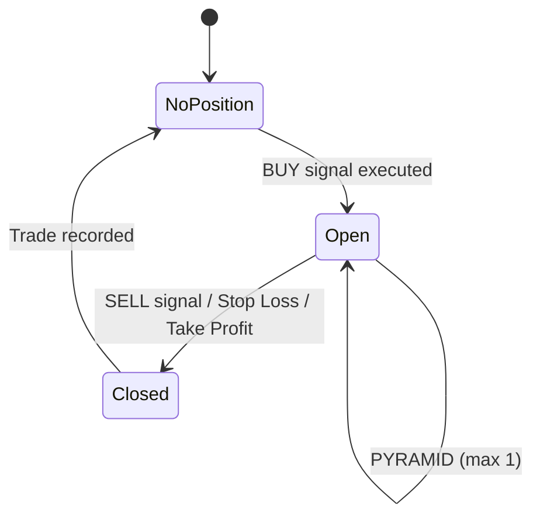

---
tags:
  - implementation/component
  - engine
---

# Position Management

How positions are opened, tracked, modified, and closed.

---

## Key Classes

| Class | File | Purpose |
|---|---|---|
| `PositionManager` | `Classes/Engine/position_manager.py` | Tracks open/closed positions, equity |
| `TradeExecutor` | `Classes/Engine/trade_executor.py` | Executes signals into actual trades |
| `Position` | `Classes/Models/position.py` | Open position data (entry price, size, stop loss, P/L) |
| `Trade` | `Classes/Models/trade.py` | Completed trade record (entry, exit, P/L, duration) |
| `Order` | `Classes/Models/order.py` | Order data class |

---

## Position Lifecycle

---

## TradeExecutor

Responsible for translating signals into position changes:

| Signal | Action |
|---|---|
| `BUY` | Open new position. Deduct commission. Set stop loss and take profit |
| `SELL` | Close position at current price. Deduct commission. Create Trade record |
| `PARTIAL_EXIT` | Reduce position size by fraction. Deduct commission on the exited portion |
| `ADJUST_STOP` | Update position's stop loss (can only move in protective direction) |
| `PYRAMID` | Add shares to existing position. Move stop to breakeven. Deduct commission |

### Commission Handling

Commission is calculated by `CommissionConfig.calculate(trade_value)`:
- **Percentage mode**: `trade_value * rate` (e.g. 0.1% of position value)
- **Fixed mode**: flat fee per trade

Commission is deducted from available capital on both entry and exit.

### Slippage

Applied as a percentage adjustment to the execution price:
- **BUY**: price is increased by slippage (you pay more)
- **SELL**: price is decreased by slippage (you receive less)

---

## PositionManager

Maintains the state of all positions:

- **Open position** — current position with live P/L tracking
- **Closed trades** — completed trades with full entry/exit records
- **Equity tracking** — capital + unrealised P/L at each bar

---

## Trade Model

A completed `Trade` records:

| Field | Description |
|---|---|
| `symbol` | Security ticker |
| `direction` | LONG or SHORT |
| `entry_date` / `exit_date` | When the trade was opened/closed |
| `entry_price` / `exit_price` | Execution prices |
| `quantity` | Number of shares |
| `pnl` | Absolute profit/loss (in base currency) |
| `pnl_pct` | Percentage profit/loss |
| `commission_paid` | Total commission for entry + exit |
| `duration_days` | Holding period |
| `exit_reason` | Why the trade was closed |

---

## Pyramiding Mechanics

When a `PYRAMID` signal is executed:

1. Additional shares are purchased at current price
2. Commission is deducted
3. Stop loss is moved to **breakeven** — calculated to cover the combined entry cost plus total commission for both the original and pyramid entries
4. The `_has_pyramided` flag is set — no further pyramiding on this trade

---

## Related

- [[Backtesting Engine]] — the engines that use these classes
- [[Signal Types]] — signals that trigger position changes
- [[Backtest Execution Flow]] — full execution sequence
