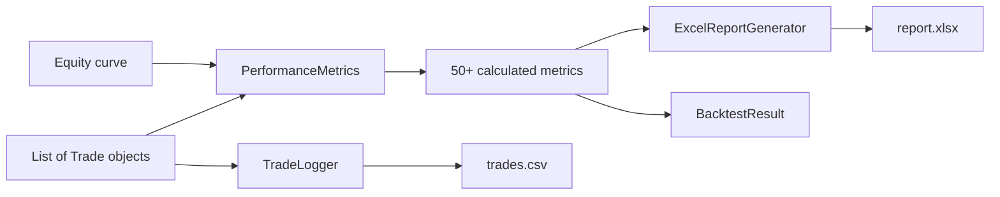

---
tags:
  - implementation/component
  - reporting
---

# Reporting

How the framework calculates metrics and generates output files.

---

## Key Classes

| Class | File | Purpose |
|---|---|---|
| `PerformanceMetrics` | `Classes/Core/performance_metrics.py` | Centralised metric calculations |
| `PerformanceMetrics` | `Classes/Analysis/performance_metrics.py` | Additional metric calculations |
| `ExcelReportGenerator` | `Classes/Analysis/excel_report_generator.py` | Generates Excel reports with charts |
| `PortfolioReportGenerator` | `Classes/Analysis/portfolio_report_generator.py` | Portfolio-specific reports |
| `TradeLogger` | `Classes/Analysis/trade_logger.py` | Exports trades to CSV |
| `OptimizationReportGenerator` | `Classes/Optimization/optimization_report.py` | Optimisation-specific reports |

---

## Metric Calculation Pipeline

Metrics are calculated from:
1. **Trade list** — win/loss statistics, durations, R-multiples
2. **Equity curve** — drawdowns, Sharpe ratio, volatility, time in market

All metrics are defined in the [[Metrics Glossary]].

---

## Excel Report Structure

The `ExcelReportGenerator` creates a multi-sheet workbook:

| Sheet | Contents |
|---|---|
| Summary | All metrics in a summary table |
| Trades | One row per trade with full details |
| Equity Curve | Chart of equity over time with drawdown overlay |
| Monthly Returns | Returns by month/year with heatmap |

Charts are generated using `openpyxl` chart objects embedded in the workbook.

---

## Output Locations

| Type | Path |
|---|---|
| Single-security reports | `logs/backtests/single_security/` |
| Portfolio reports | `logs/backtests/portfolio/` |
| Optimisation reports | `logs/optimization_reports/` |
| Vulnerability reports | `reports/vulnerability/` |
| Trade analysis | `reports/per_trade_analysis/` |

---

## Related

- [[Reading Reports]] — user guide for interpreting output
- [[Metrics Glossary]] — all metric definitions
