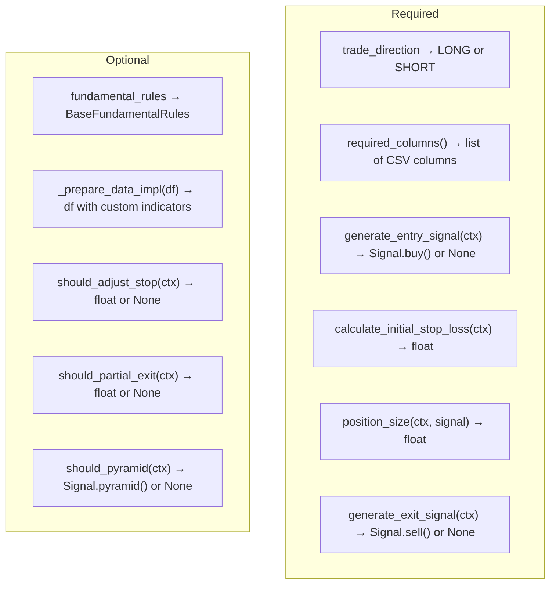
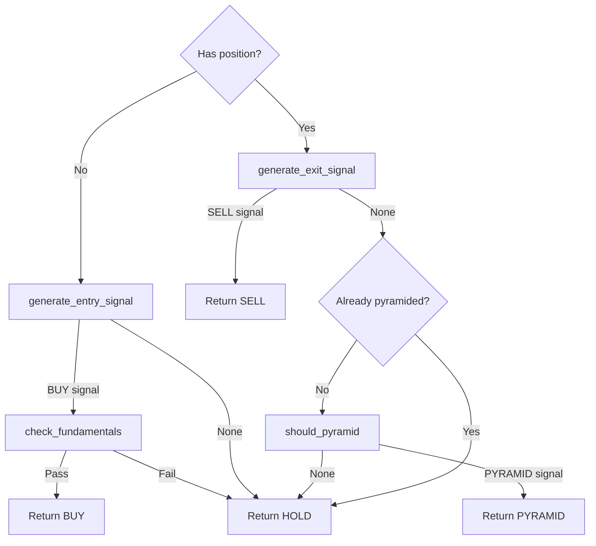

---
tags:
  - implementation/component
  - strategy
---

# Strategy Framework

The contract between strategies and the engine.

---

## Key Classes

| Class | File | Purpose |
|---|---|---|
| `BaseStrategy` | `Classes/Strategy/base_strategy.py` | Abstract base class all strategies extend |
| `StrategyContext` | `Classes/Strategy/strategy_context.py` | Data passed to strategy on each bar |
| `BaseFundamentalRules` | `Classes/Strategy/fundamental_rules.py` | Optional fundamental entry filters |

---

## BaseStrategy Contract

Every strategy must implement **six required methods**:

---

## StrategyContext

The context object is created fresh for each bar by the engine. It provides:

| Property | Description |
|---|---|
| `current_bar` | Current bar's data (dict-like row) |
| `current_price` | Current closing price |
| `current_index` | Bar index in the data |
| `symbol` | Security ticker |
| `has_position` | Whether a position is currently open |
| `position` | Current `Position` object (if any) |
| `available_capital` | Capital not allocated to positions |
| `total_equity` | Total account value |
| `fx_rate` | Current FX rate for this security |
| `previous_bar` | Previous bar's data |

| Method | Description |
|---|---|
| `get_indicator_value(name)` | Get a column value from the current bar |

> [!warning] No Future Access
> `StrategyContext` only exposes data up to and including the current bar. There is no way to access future bars.

---

## Signal Generation Flow

The engine calls `strategy.generate_signal(context)` on every bar. Internally, `BaseStrategy` orchestrates:

---

## Parameter System

Strategies receive parameters via `**kwargs` in `__init__()` and store them in `self.params`. Parameters are:

- Accessible via `self.get_parameter(name, default)`
- Serialisable for optimisation and presets
- Defined centrally in `config/strategy_parameters.json` for GUI/optimiser integration

---

## Data Preparation

`prepare_data()` runs **once** before the backtest starts. It:

1. Validates all `required_columns()` exist in the CSV data
2. Calls `_prepare_data_impl()` for custom indicator calculation
3. Checks new columns for look-ahead bias (NaN pattern analysis)

This is the only place where strategies can compute derived indicators. The framework monitors for `.shift(-n)` patterns that would indicate look-ahead bias.

---

## Related

- [[Adding a New Strategy]] — step-by-step guide to creating a strategy
- [[Signal Types]] — all signal types and factory methods
- [[Backtest Execution Flow]] — how the engine calls these methods
