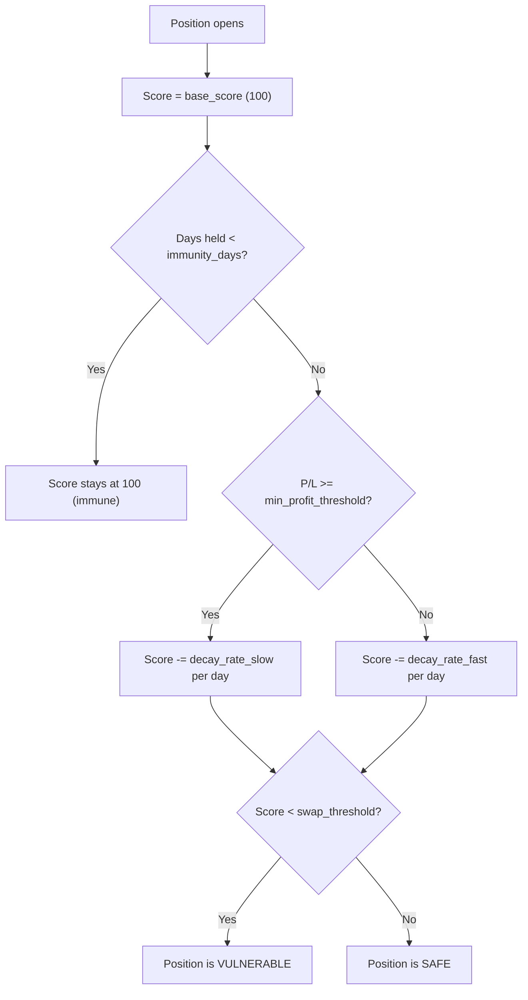
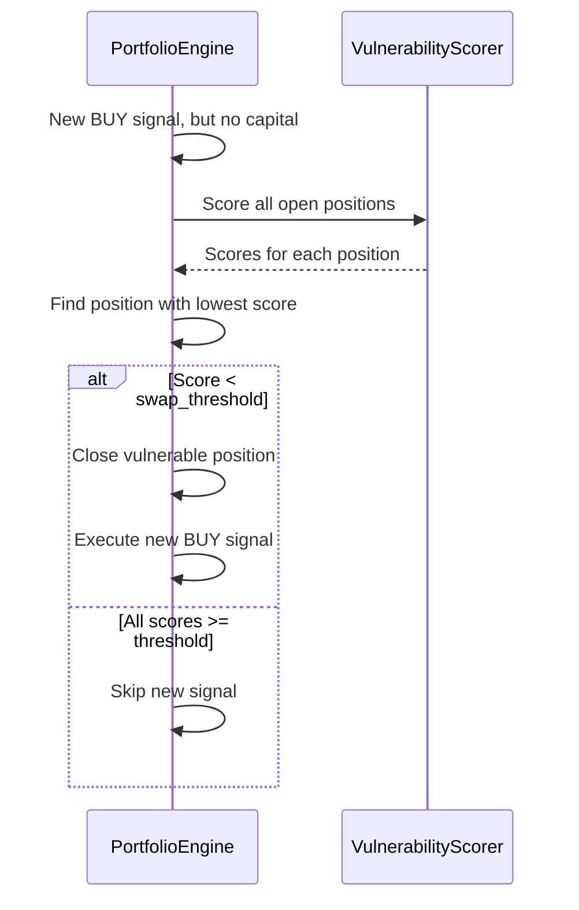

---
tags:
  - implementation/component
  - portfolio
  - vulnerability
---

# Vulnerability Scorer

Scores open positions to determine which should be closed when capital is needed for a new signal.

---

## Key Classes

| Class | File | Purpose |
|---|---|---|
| `VulnerabilityScoreCalculator` | `Classes/Engine/vulnerability_score.py` | Simple time-based scoring used by the engine |
| `VulnerabilityScoreParams` | `Classes/VulnerabilityScorer/scoring.py` | Feature-based scoring parameters |
| `FeatureWeight` | `Classes/VulnerabilityScorer/features.py` | Per-feature configuration |
| Portfolio simulation | `Classes/VulnerabilityScorer/` | Simulates scoring impact |

---

## Simple Scoring Algorithm

Used by `VULNERABILITY_SCORE` mode:



### Score Calculation

```
days_past_immunity = max(0, days_held - immunity_days)

if position P/L >= min_profit_threshold:
    score = base_score - (days_past_immunity * decay_rate_slow)
else:
    score = base_score - (days_past_immunity * decay_rate_fast)
```

---

## Enhanced (Feature-Based) Scoring

Used by `ENHANCED_VULNERABILITY` mode. Instead of a single decay formula, the score is influenced by multiple weighted features:

| Feature | Default Weight | Effect |
|---|---|---|
| `days_held` | -5.0 | Penalises older positions |
| `current_pl_pct` | +1.0 | Rewards profitable positions |
| `pl_momentum_7d` | +3.0 | Rewards positive recent momentum |
| `pl_momentum_14d` | 0.0 | Medium-term momentum (disabled by default) |
| `volatility_7d` | +0.5 | Slightly rewards volatility |
| `distance_from_high` | 0.0 | Penalty for being far from 52W high (disabled) |
| `max_favorable_excursion` | 0.0 | Penalty for giving back gains (disabled) |
| `entropy_7d` | 0.0 | Price noise measure (disabled) |

Each feature can optionally use **advanced parameters** (per-feature decay rates, stagnation thresholds) instead of a constant weight.

### Tiebreaking

When multiple positions have the same score, `tiebreaker_order` determines which is swapped first (default: worst `current_pl_pct`, then highest `days_held`).

---

## Integration with Portfolio Engine



---

## Built-In Presets

| Preset | Immunity | Threshold | Character |
|---|---|---|---|
| Conservative | 14 days | 30 | Slow to swap, protects positions |
| Aggressive | 3 days | 70 | Quick to swap underperformers |
| Momentum Focused | 7 days | 50 | Emphasises recent P/L trend |

---

## Related

- [[Vulnerability Scoring]] — user guide
- [[Creating Vulnerability Presets]] — create custom configurations
- [[Portfolio Execution Flow]] — how scoring fits into portfolio backtesting
