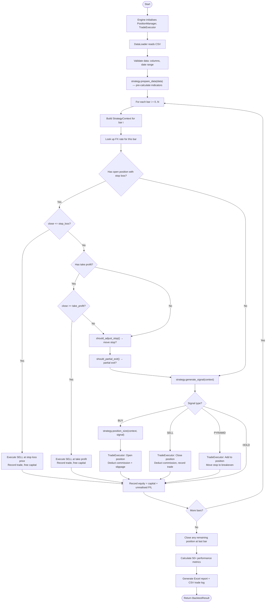

---
tags:
  - implementation/flow
  - engine
---

# Backtest Execution Flow

The complete bar-by-bar execution sequence for a single-security backtest.

---

## End-to-End Flow

---

## Bar Processing Detail

On each bar, the engine processes in this exact order:

### 1. Build Context
`StrategyContext` is created with:
- Current bar data, price, and index
- Current position (if any)
- Available capital and total equity
- FX rate from `CurrencyConverter`

### 2. Check Stop Loss
If there's an open position with a stop loss and the current close price has breached it, the position is **immediately closed** at the stop loss price. The strategy is not consulted.

### 3. Check Take Profit
Same as stop loss, but for the take profit level (if set).

### 4. Trailing Stop
`strategy.should_adjust_stop(context)` is called. If it returns a new price, the stop is moved — but only in the protective direction (up for LONG, down for SHORT).

### 5. Partial Exit
`strategy.should_partial_exit(context)` is called. If it returns a fraction, that portion of the position is closed.

### 6. Strategy Signal
`strategy.generate_signal(context)` is called. Internally, this:
- If no position: calls `generate_entry_signal()` → checks `fundamental_rules` → returns BUY or HOLD
- If in position: calls `generate_exit_signal()` → checks `should_pyramid()` → returns SELL, PYRAMID, or HOLD

### 7. Execute Signal
The `TradeExecutor` opens, closes, or modifies the position based on the signal.

### 8. Record Equity
Current equity (capital + unrealised P/L) is appended to the equity curve.

---

## Key Invariants

> [!warning] Order Matters
> Stop loss and take profit are checked **before** the strategy generates signals. This means a strategy cannot override a stop loss hit on the same bar.

- Only one position open at a time per security
- Maximum one pyramid per trade
- Trades execute at the close price (adjusted for slippage)
- Commission is deducted on every entry and exit

---

## Related

- [[Backtesting Engine]] — component details
- [[Position Management]] — position lifecycle
- [[Strategy Framework]] — signal generation logic
