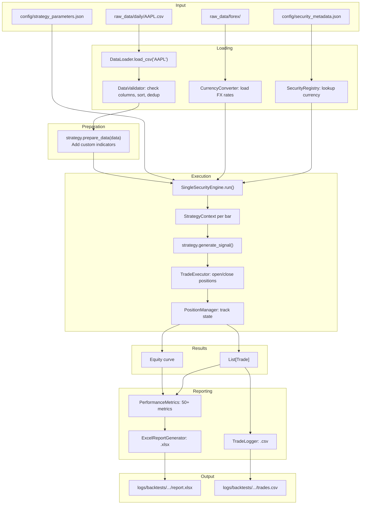

---
tags:
  - implementation/flow
  - data
  - reporting
---

# Data to Report Pipeline

The full lifecycle from raw CSV data to a finished Excel report.

---

## Pipeline

---

## Stage Breakdown

### 1. Loading
`DataLoader` reads the CSV into a pandas DataFrame. `DataValidator` ensures required columns exist, sorts by date, and removes duplicates. `SecurityRegistry` looks up the security's currency so the engine knows whether FX conversion is needed.

### 2. Preparation
`strategy.prepare_data()` runs once. It validates that all `required_columns()` exist in the data, then calls `_prepare_data_impl()` for any strategy-specific indicator calculations. The framework checks new columns for look-ahead bias.

### 3. Execution
The engine iterates bar-by-bar. On each bar:
- `StrategyContext` is built with current data, position state, and FX rate
- Stop loss / take profit are checked
- `strategy.generate_signal()` returns a signal
- `TradeExecutor` executes the signal
- `PositionManager` updates state

### 4. Results
After all bars are processed, remaining positions are closed. The engine produces a list of completed `Trade` objects and an equity curve.

### 5. Reporting
`PerformanceMetrics` calculates 50+ metrics from the trades and equity curve. `ExcelReportGenerator` creates a multi-sheet Excel workbook with summary, trade list, charts, and monthly returns. `TradeLogger` exports a flat CSV of all trades.

### 6. Output
Files are saved to `logs/backtests/single_security/` (or `portfolio/` for portfolio mode) with timestamps in the filename.

---

## Data Dependencies

| What | Where | Required By |
|---|---|---|
| Price data | `raw_data/daily/*.csv` | DataLoader |
| Security metadata | `config/security_metadata.json` | SecurityRegistry |
| FX rates | `raw_data/forex/*.csv` | CurrencyConverter |
| Strategy params | `config/strategy_parameters.json` | GUI, Optimiser |
| Presets | `config/strategy_presets/*.json` | GUI |

---

## Related

- [[Data Layer]] — loading and validation components
- [[Backtesting Engine]] — execution engine
- [[Reporting]] — metrics and report generation
- [[Reading Reports]] — how to interpret the output
