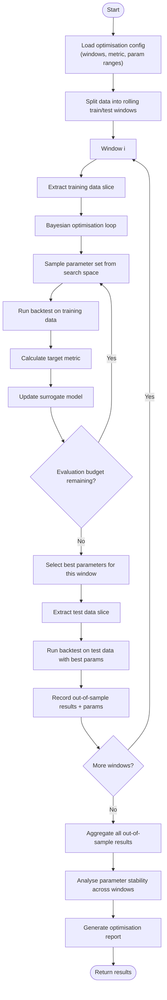

---
tags:
  - implementation/flow
  - optimisation
---

# Optimisation Flow

End-to-end walk-forward optimisation pipeline.

---

## Flow



---

## Step Details

### 1. Window Splitting

The data is divided into overlapping train/test pairs:

```
|------- Train 1 -------|--- Test 1 ---|
         |------- Train 2 -------|--- Test 2 ---|
                  |------- Train 3 -------|--- Test 3 ---|
```

- **Rolling mode**: train window is fixed width, slides by `step_size` each iteration
- **Anchored mode**: train window starts from the same date, grows each iteration

### 2. Bayesian Search (Per Window)

Within each training window, the optimiser:
1. Evaluates a few random parameter sets
2. Builds a Gaussian Process model of metric vs parameters
3. Uses an acquisition function to pick the next most informative point
4. Runs a backtest with those parameters
5. Updates the model
6. Repeats until budget (number of evaluations) is exhausted

### 3. Out-of-Sample Validation

The best parameters from training are applied to the adjacent test window. This is unseen data — the strategy has never trained on it. The test results are the **realistic** performance estimate.

### 4. Aggregation

All test-window results are combined into a single performance summary. This gives the strategy's expected real-world performance.

### 5. Parameter Stability

The optimiser reports how much the best parameters varied across windows:
- **Low variance** → parameters are robust
- **High variance** → parameters may be overfit to specific market conditions

---

## Relationship to Components

| Step | Component |
|---|---|
| Data loading | [[Data Layer]] |
| Backtest execution | [[Backtesting Engine]] |
| Bayesian search | [[Optimisation Engine]] (scikit-optimize) |
| Metric calculation | [[Reporting]] (PerformanceMetrics) |
| Report generation | OptimizationReportGenerator |

---

## Related

- [[Walk-Forward Optimisation]] — user guide
- [[Optimisation Engine]] — component details
