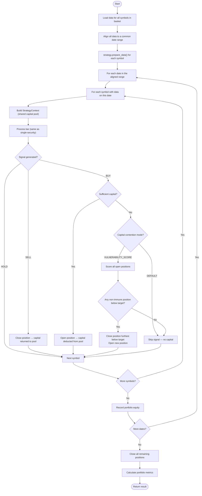

---
tags:
  - implementation/flow
  - portfolio
  - engine
---

# Portfolio Execution Flow

How the portfolio engine manages multiple securities with shared capital and capital contention.

---

## Overview

The portfolio engine runs the same bar-by-bar logic as the [[Backtest Execution Flow|single-security engine]], but across multiple securities simultaneously, with a **shared capital pool**.

---

## Flow

---

## Capital Pool

All securities share a single capital pool:

- **Available capital** = initial capital - capital deployed in open positions
- When a position is opened, capital is deducted
- When a position is closed, capital (plus P/L minus commission) is returned
- Total equity = available capital + sum of all unrealised P/L

---

## Capital Contention Resolution

When a BUY signal arrives but capital is insufficient:

### DEFAULT Mode
The signal is simply skipped. The engine logs that a signal was missed due to insufficient capital.

### VULNERABILITY_SCORE Mode
1. For every open position, compute a target price
   `P_target(t) = P_entry * (1 + g_d)^t * perf_ratio^(-alpha) * (1 + beta * min(r14, 0))`
   where `g_d` comes from `target_monthly_growth`, `perf_ratio = (1 + r_long) / (1 + g_d)`
   and `r14` is the mean of recent daily returns.
2. Each position's vulnerability score is the percentage distance of the
   current (averaged) price below its target, or `0` when:
   - the trade is younger than `min_trade_age_days` (age immunity), or
   - the current price is at or above the target.
3. If at least one position is non-immune, close the one with the largest
   % distance below target and execute the new BUY signal.
4. If all positions are immune, skip the signal.

---

## Date Alignment

Securities may have different data ranges (e.g. AAPL has data from 2000, a newer stock from 2015). The engine:

1. Finds the common date range across all securities
2. On each date, only processes symbols that have data for that date
3. Handles missing dates (holidays, delistings) gracefully

---

## Per-Symbol vs Portfolio Results

The engine tracks:
- **Per-symbol**: individual trade lists, equity contributions
- **Portfolio-level**: aggregated equity curve, total trades, capital utilisation

---

## Related

- [[Portfolio Backtest]] — user guide
- [[Backtest Execution Flow]] — single-security flow (building block)
