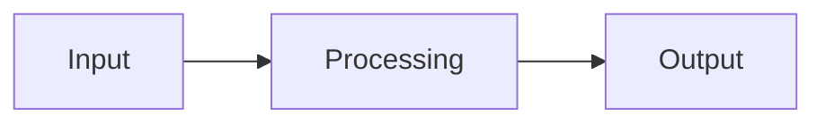

---
tags:
  - template
  - implementation
---

# New Component Template

Use this template when documenting a new system component for the [[_Implementation Index|Implementation]] section.

---

```markdown
---
tags:
  - implementation/component
  - [relevant-tag]
---

# [Component Name]

[One-sentence description of what this component does.]

---

## Key Classes

| Class | File | Purpose |
|---|---|---|
| `ClassName` | `Classes/Module/file.py` | [What it does] |

---

## How It Works

[High-level explanation. Use a Mermaid diagram if the flow is non-trivial.]



---

## Key Design Decisions

[Explain any non-obvious choices and their rationale.]

---

## Configuration

[What config files or parameters affect this component.]

---

## Related

- [[Related Page 1]] — [why it's related]
- [[Related Page 2]] — [why it's related]
```
